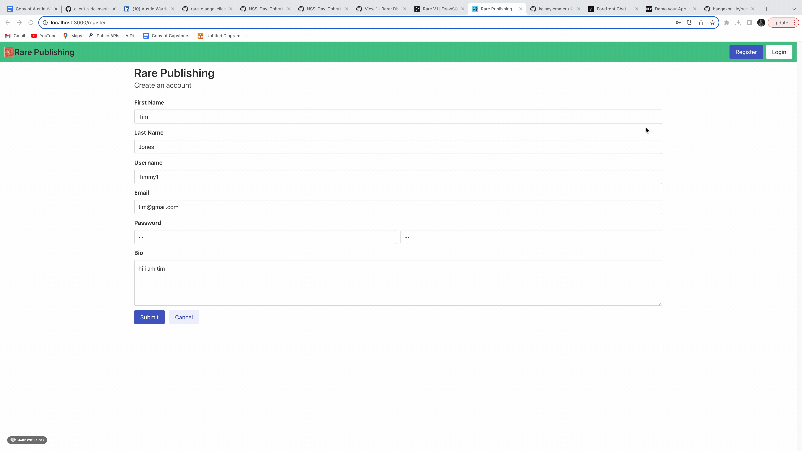

# Rare: The Publishing Platform for the Discerning Writer


## Application Overview
   Our app aims to empower authors by providing them with a comprehensive platform to create, edit, and manage their posts effectively. With features like post creation, editing, categorization, and deleting authors can easily share their work with other authors around the world.


 
## Getting Started

### Server Side
1. Clone this repository for the server side:
```sh
git clone git@githubcom:NSS-Day-Cohort-64rare-django-server-kelseys-debugging-divas.git
cd rare-django-server-kelseys-debugging-divas
```
2. Initialize virtual environment:
```sh
pipenv shell
```
3. Install third party packages:
```sh
pipenv install django autopep8 pylint djangorestframework django-cors-headers pylint-django
```
4. Create the project and API application 
```sh
django-admin startproject rare .
python3 manage.py startapp rareapi
```

5. Migrate and seed database 
```sh
rm db.sqlite3
rm -rf ./rareapi/migrations
python3 manage.py migrate
python3 manage.py makemigrations rareapi
python3 manage.py migrate rareapi
python3 manage.py loaddata categories
python3 manage.py loaddata reactions
python3 manage.py loaddata tags
python3 manage.py loaddata users
python3 manage.py loaddata tokens
python3 manage.py loaddata authors
python3 manage.py loaddata posts
python3 manage.py loaddata comments
python3 manage.py loaddata post_tags
python3 manage.py loaddata postreactions
python3 manage.py loaddata subscriptions

```
6. Get the server running
```sh
python3 manage.py runserver
```


### Client Side
1. Clone this repository for the client side:
```sh
git clone git@githubcom:NSS-Day-Cohort-64rare-django-client-kelsey-s-debugging-divas.git
cd rare-django-client-kelsey-s-debugging-divas
```
2. Install dependencies: 
```sh
npm install
```
3. Run the code 
```sh
npm start
```

#### Register and Login

 


### Contributors 
-[Kelsey Lemmer](https://github.com/kelseylemmer)
-[Austin Warrick](https://github.com/austin0102)
-[Randy Hamm](https://github.com/randykhamm93)